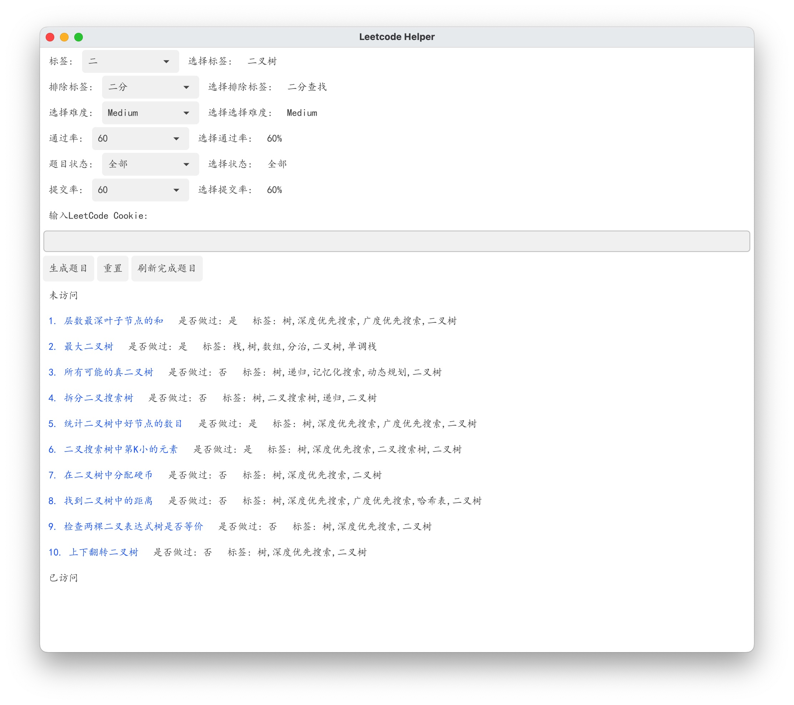

# Leetcode题目筛选软件
仅支持Windows用户的Leetcode选题软件，可以根据需求筛选出题目 </br>
支持按照类型，难度，通过率，提交量, 做题状态筛选题目，无联网操作，实时生成符合条件的随机题目 </br>
如果需要获取题目做过状态, 在Cookie输入框填入Cookie信息，系统会自动抓取最新的做题状态信息


## 安装
进入anyleetcode目录，执行目录下的build.sh脚本，执行成功后在output目录下生成leetcode.app文件，将其拖入应用目录即可。
```bash
bash build.sh
```

可直接在release中下载leetcode.zip附件，直接解压即可

## 效果图
